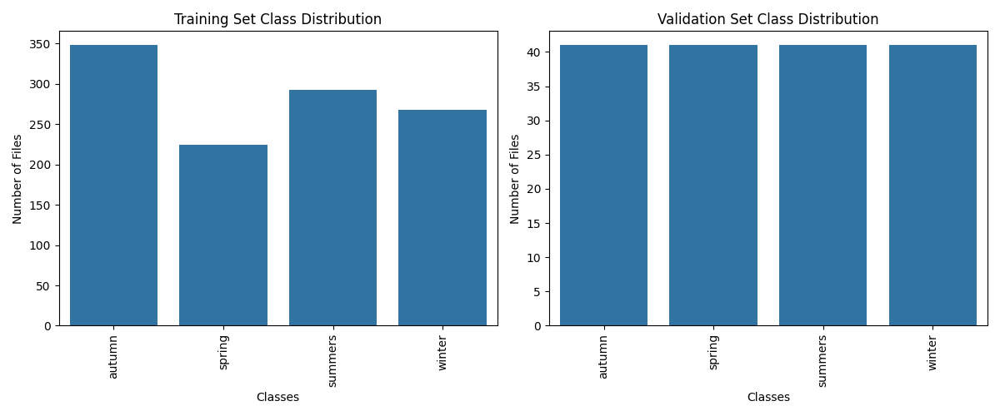
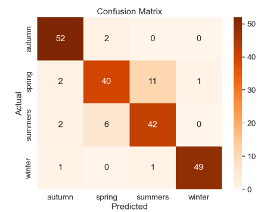
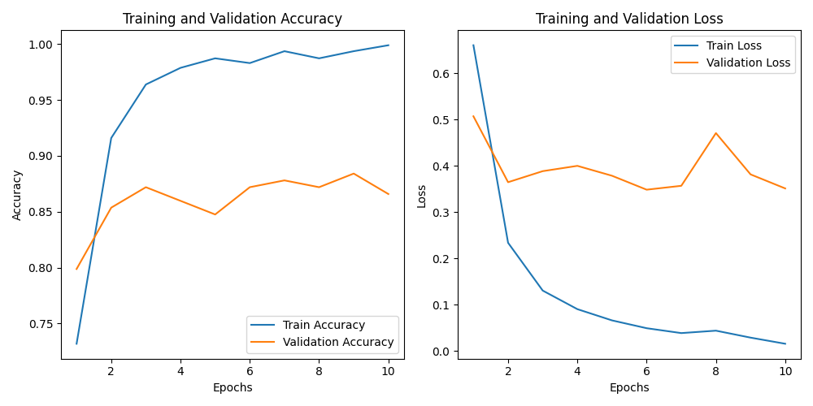
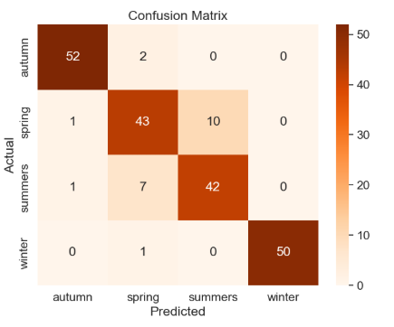
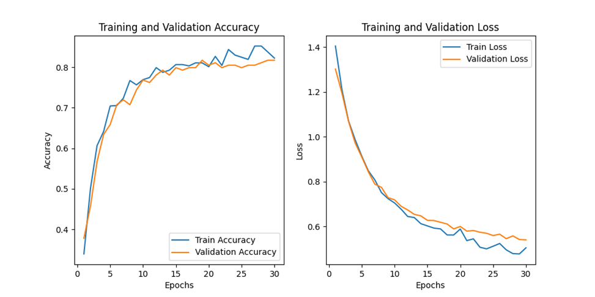

# Prediction Season — Предсказание сезона по изображению

## Описание

Веб-приложение для классификации времени года по изображению с использованием глубокого машинного обучения.

Программа получает на вход изображение и выдаёт предсказание сезона (autumn, spring, summer, winter) с указанием вероятности в процентах.

**Стек технологий:**
- **PyTorch** — глубокое обучение
- **FastAPI** — веб-фреймворк
- **ResNet-18** — архитектура нейросети (предобученная на ImageNet)
- **Python 3.12**

**Лучшие Метрики:**
- Accuracy на валидации: **~88%**
- Accuracy на тестовом наборе: **~89%**

---

## Выбор архитектуры модели
Модель машинного обучения реализована с использованием PyTorch, так как это одна из самых популярных библиотек для глубокого обучения с большим количеством обучающих гайдов. PyTorch показался наиболее удобным и практичным решением.

Для задачи классификации изображений по сезонам использовались предобученные сверточные нейронные сети. Использование ручного отбора признаков не применялось, так как это усложняет процесс и требует значительного опыта в обработке изображений.

Протестированы следующие архитектуры:
- ResNet-18
- MobileNetV3
- DenseNet-161
- vgg16

ResNet-18 показал наилучший результат:
- Быстрое обучение
- Высокая точность (~89% на валидации)
- Низкие требования к памяти

Движение в сторону более тяжелых моделей сильно нагружало GPU, и не давало существенного прироста точности.
Более легкие модели вроде MobileNetV3 показали небольшое отставание.
В свою очередь ResNet-18 показал наилучший результат:
- Быстрое обучение
- Высокая точность (~89% на валидации)
- Низкие требования к памяти
---

## Набор данных
Для тренировки был создан новый набор данных, который разделён на 3 части: validation, test, train.
Также входные данные были преобразованы в размер 224×224 для удовлетворения требований предобученных сетей ImageNet.

**Рисунок 1.** Распределение изображений по сезонам в датасете (train: 1133, validation: 164, test: 209).



Сам набор данных имеет 1133 изображений на тренировку и 164 на валидацию. Выше показан график распределения картинок по классификации.

В файле class_to_idx.json представлен набор сопоставления меток классов изображений с названием этих классов.

Для оценки производительности тестирование будет производиться на тестовом наборе данных из 209 изображений, которые не участвовали в обучении модели.

## Обучение модели
###  Результаты обучения

В ходе эксперимента с разными наборами данных было получены результаты.
Изменение кол-ва эпох, batch size или lr изменение не дало.

| Метрика | Значение |
|---------|----------|
| Архитектура | ResNet-18 |
| Batch Size | 64 |
| Epochs | 10 |
| Learning Rate | 0.0001 |
| Train Accuracy | ~98% |
| Validation Accuracy | ~90% |
| Test Accuracy | ~87% |
| Аугментация | Нет |
| Заморозка слоёв | Нет |


Результаты тестирование на тестовом датасёте

**Рисунок 2.** Матрица ошибок модели на тестовом датасете (точность ~87%).



Как видно, модель угадала 87% всех тестовых изображений.

### Аугментация данных
Для повышения обощенности и повышения работоспособности модели будем использовать аугментацию данных

**Обучение:**
- Resize: 256×256 → CenterCrop: 224×224
- Случайный поворот: 20°
- Случайное горизонтальное отзеркаливание: 50%
- Нормализация (ImageNet стандарт): mean=[0.485, 0.456, 0.406], std=[0.229, 0.224, 0.225]

**Валидация/Тест:**
- Resize: 256×256 → CenterCrop: 224×224
- Нормализация


**Рисунок 3.** Графики обучения модели с аугментацией данных (точность и потери на train/validation).



| Метрика | Значение |
|---------|----------|
| Архитектура | ResNet-18 |
| Batch Size | 64 |
| Epochs | 10 |
| Learning Rate | 0.0001 |
| Train Accuracy | ~99% |
| Validation Accuracy | ~88% |
| Test Accuracy | ~89% |
| Аугментация | Да |
| Заморозка слоёв | Нет |

Можно наблюдать небольшой прирост Test Accuracy и уменьшение Validation Accuracy.

Матрица ошибок

**Рисунок 4.** Матрица ошибок модели ResNet-18 на тестовом датасете.



---
### Заморозка слоёв 
Были попытки заморозки слоёв, с кастомным классификатором для обучения только финального слоя, т.к. предобученные модели уже умеют различать базовые признаки изображений.

| Метрика | Значение |
|---------|----------|
| Архитектура | ResNet-18 |
| Batch Size | 64 |
| Epochs | 30 |
| Learning Rate | 0.0001 |
| Train Accuracy | ~90% |
| Validation Accuracy | ~81% |
| Аугментация | Да |
| Заморозка слоёв | Да |

Модель упёрлась в потолок 0.81 к 30 эпохе. 

**Рисунок 5.** Графики обучения модели с заморозкой слоёв (точность и потери на train/validation).




---

### Тестирование друхи пердобученных моделей.
Были протестированы модели MobileNetV3, Densenet-161 и vgg16.
Densenet-161 оказал существенную нагрузку на GPU (вплоть до получения артефактов на экране монитора).

Лучший полученный результат с MobileNetV3. 
| Метрика | Значение |
|---------|----------|
| Архитектура | MobileNetV3 |
| Batch Size | 64 |
| Epochs | 10 |
| Learning Rate | 0.0001 |
| Train Accuracy | ~90% |
| Validation Accuracy | ~84% |
| Аугментация | Да |
| Заморозка слоёв | Нет |

Лучший полученный результат с vgg16. 
| Метрика | Значение |
|---------|----------|
| Архитектура | MobileNetV3 |
| Batch Size | 64 |
| Epochs | 10 |
| Learning Rate | 0.0001 |
| Train Accuracy | ~86% |
| Validation Accuracy | ~81% |
| Аугментация | Да |
| Заморозка слоёв | Да |


# Установка проекта из репозитория  GitHub.
### Установить Python 3.12

- Для Windows https://www.python.org/downloads/
- Для Linux 
```bash
sudo apt update
sudo apt -y install python3-pip
sudo apt install python3.12
``` 
### Клонировать репозиторий и перейти в него в командной строке.
```bash
 git clone https://github.com/Rashid-creator-droid/predicting_season.git
 cd predicting_season
``` 
###  Развернуть виртуальное окружение.
```bash
python -m venv venv
``` 
 - для Windows;
```bash
venv\Scripts\activate.bat
``` 
 - для Linux и MacOS.
```bash
source venv/bin/activate

```
### Установить зависимости

**Важно:** Установите PyTorch, совместимый с вашей версией CUDA (если у вас NVIDIA GPU). Проверьте версию CUDA командой `nvidia-smi` и выберите подходящую версию на [официальном сайте PyTorch](https://pytorch.org/get-started/locally/). Например:
- Для CUDA 11.8: `pip install torch torchvision torchaudio --index-url https://download.pytorch.org/whl/cu118`

Затем установите остальные зависимости:

```bash
pip install -r requirements.txt
```

### Запуск проекта
```bash
python main.py
```
### Проект будет доступен по адресу.
```bash
http://127.0.0.1:8001/
```
### Запуск тренировки из корня проекта

```bash
python -m ml.trainer
```

Лучшая полученная модель во время тренировки сохранится в `ml/weights/best_model.pth`.

## Веб-приложение

В веб-приложении реализовано:
- Предсказание времени года с отображением % уверенности
- Оценка точности на наборе тестовых данных с отображением средней точности в % и матрицы ошибок


## Конфигурация

Параметры конфигурации обучения модели находятся в [ml/config.py](ml/config.py):

```python
NUM_CLASSES = 4
BATCH_SIZE = 64
EPOCHS = 10
LEARNING_RATE = 0.0005
MODEL_NAME = "resnet18"
PRETRAINED = True
```
---

## Установка и запуск проекта через Docker
### Склонировать репозиторий и перейти в папку с проектом в командной строке
```bash
    git clone https://github.com/Rashid-creator-droid/predicting_season.git
```
```bash
    cd predicting_season
```
### Запустить сборку контейнера Docker Compose V2
По умолчанию проект использует образ из Docker Hub. Для запуска:
```bash
    docker compose up --build
``` 
### Проект будет доступен по адресу
```
http://localhost:8000/
```

## Основные модули

### `ml/trainer.py`
Основной скрипт обучения. Загружает данные, инициализирует модель, проводит обучение с сохранением лучших весов.

### `ml/predict.py`
Класс `SeasonPredictor` для загрузки модели и предсказания на новых изображениях. Используется в веб-приложении.

### `ml/eval_test.py`
Функции для оценки модели на тестовом наборе:
- `evaluation_model()` — расчёт accuracy, матрица ошибок
- `plot_confusion_matrix()` — визуализация

### `ml/loaders.py`
Загрузчики данных (DataLoader) для обучения, валидации и теста.

### `ml/transforms.py`
Трансформации изображений с аугментацией для обучения.

### `ml/models/models.py`
Загрузка предобученных моделей (ResNet-18, vgg16 и т.д.) с заменой финального слоя.

---

##  API

### POST /predict
Предсказание сезона по изображению.

**Запрос:**
```json
{
  "image": "<base64 encoded image>"
}
```

**Ответ:**
```json
{
  "season": "autumn",
  "probability": 0.98
}
```
### GET /test_dataset
Тестирование на наборе данных.


**Ответ:**
```json
{
  "cm_image": "cm_image_base64",
  "accuracy": 0.98
}
```
